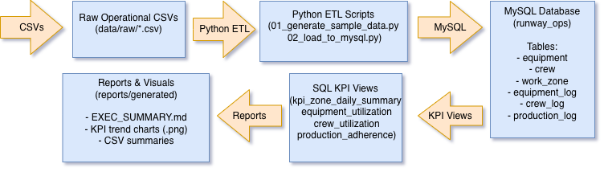

# Runway Renewal Operations Analytics

Operations analytics project using SQL and Python to improve resource 
utilization,
schedule adherence, and production performance for a runway renewal 
program.

## Overview
This project transforms operational field data (equipment usage, crew 
allocation,
and production logs) into KPI views and repeatable executive reporting.

## Architecture




## Tech Stack
- MySQL 8 (SQL views)
- Python (pandas, SQLAlchemy, matplotlib)
- Shell scripting
- Git

## Project Structure
- `data/` – sample operational CSVs
- `sql/schema/` – table definitions
- `sql/kpis/` – KPI views
- `scripts/` – end-to-end pipeline
- `reports/generated/` – charts and executive summary

## Quickstart (Local)
### Configure DB (Recommended: secure MySQL login-path)

This avoids placing passwords directly in shell commands.

```bash
mysql_config_editor set --login-path=runway_ops --host=localhost --user=runway_user --password
mysql --login-path=runway_ops -e "SELECT NOW();"
```

### Prerequisites
- Python 3.10+
- MySQL 8.x with `mysql` CLI

### Install
```bash
python3 -m venv .venv
source .venv/bin/activate
pip install -r requirements.txt

